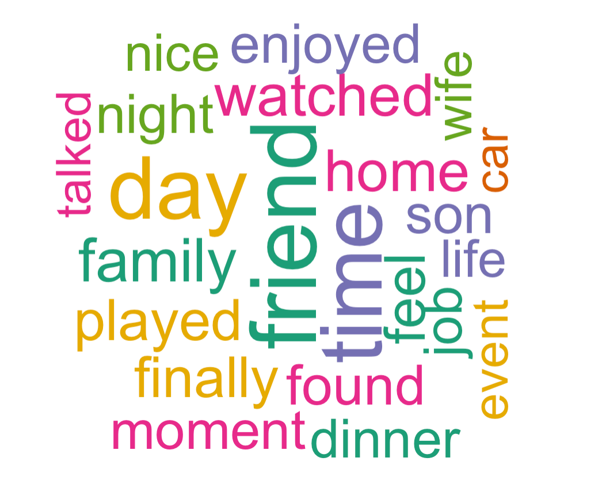

# Applied Data Science @ Columbia
## STAT GR5243/GU4243 Fall 2023
## Project 1:An R Notebook Data Story on Happy Moments



### [Project Description](doc/Proj1_desc.md)
This is the first and only *individual* (as opposed to *team*) this semester. 

Term: Fall 2023

+ Projec title: What is the current trend for gaining happiness? Is it same across demographics?
+ This project is conducted by Forain Zhang

+ Project summary: Understanding the constituents of happiness has long been a pursuit in psychological and social research. This project utilizes the HappyDB corpus—a large collection of self-reported happy moments—to dissect and analyze the language of joy and satisfaction. Employing natural language processing techniques such as word clouds and Latent Dirichlet Allocation (LDA) for topic modeling and k-means clusterings, alongside demographic analysis, we seek to unravel the themes and patterns that underpin expressions of happiness. Our findings illuminate a significant emphasis on social bonds, with words like "family," "friends," and "home" dominating the discourse. Furthermore, demographic insights reveal a variation in the sources of happiness across different age groups and between genders, reflecting a complex interplay between societal roles and personal experiences. Through a detailed examination of textual data, this project contributes to a deeper understanding of how happiness is articulated and experienced across diverse spectra of life, offering valuable perspectives for future research and applications in the field of positive psychology.

+ Questions will be answered:

1. What are the current trend for happiness by keywords
2. Any difference of trend across demographics such as age and gender
3. What are the main categories of those happiness

Following [suggestions](http://nicercode.github.io/blog/2013-04-05-projects/) by [RICH FITZJOHN](http://nicercode.github.io/about/#Team) (@richfitz). This folder is orgarnized as follows.

```
proj/
├── lib/
├── data/
├── doc/
├── figs/
└── output/
```

Please see each subfolder for a README file.
